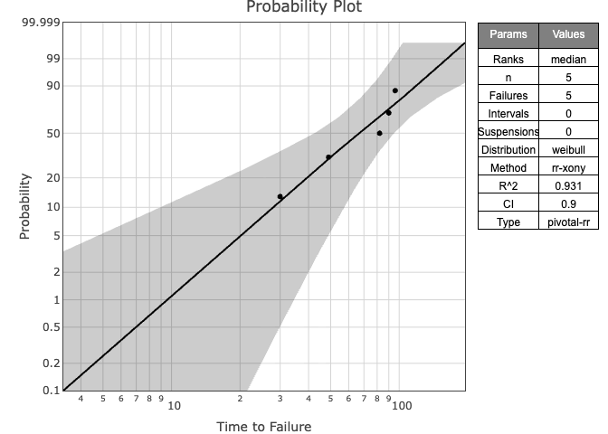

## WeibullR.plotly

A simple R package for building interactive Weibull
Probability Plots that depends on WeibullR, a R package for
Weibull analysis, and plotly, an interactive web-based graphing library.

## Getting Started

WeibullR.plotly is still in development. To install the developmental
version in R:

``` r
devtools::install_github('paulgovan/weibullr.plotly')
```

## Basic Examples

To build a probability plot, first fit a `wblr` object using the
`WeibullR` package and then use `plotly_wblr` to build the plot.

``` r
library(WeibullR)
library(WeibullR.plotly)
failures<-c(30, 49, 82, 90, 96)
obj<-wblr.conf(wblr.fit(wblr(failures)))
plotly_wblr(obj)
```

<!-- -->

To build a contour plot, use the `plotly_contour` function. Note that
contour plots are only available where `method.fit='mle'` and
`method.conf='lrb'`.

``` r
obj<-wblr.conf(wblr.fit(wblr(failures), method.fit = 'mle'), method.conf = 'lrb')
plotly_contour(obj)
```

<!-- -->

## Customization

WeibullR.plotly has several customization options.

``` r
plotly_wblr(obj, main='Weibull Probability Plot', xlab='Years', ylab='Failure Probability', col='blue', signif=4, grid=FALSE)
```

<!-- -->

``` r
plotly_contour(obj, main='Weibull Contour Plot', col='red', signif=4, grid=FALSE)
```

<!-- -->

## More Resources

For an interactive introduction to Life Data Analysis, check out
[WeibullR.learnr](https://paulgovan.github.io/WeibullR.learnr/)

To try WeibullR.plotly in a Shiny app, check out
[WeibullR.shiny](https://paulgovan.github.io/WeibullR.shiny/)
